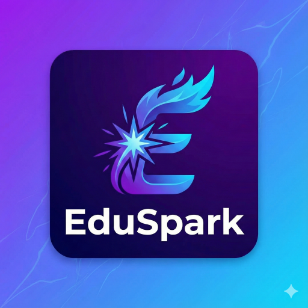

<div align="center">
  

  <h1>🚀 EduSpark</h1>

  <h3>The Future of Learning</h3>

  <p>
    <strong>A Premium Progressive Web App (PWA) for Modern Education</strong><br/>
    Fast • Secure • Offline‑Ready • Mobile‑First
  </p>

  <p>
    <a href="https://edusaprks.netlify.app/">🌐 Live Demo</a> •
    <a href="https://github.com/SachinYedav/EduSpark/issues">🐞 Report Bug</a> •
    <a href="https://github.com/SachinYedav/EduSpark/pulls">✨ Request Feature</a>
  </p>

  <p>
    
    
    
    
    
  </p>
</div>

---

> ⚠️ **DISCLAIMER:**
> This project is a **Portfolio/Educational Prototype** created to demonstrate modern web development skills (PWA, Firebase, Vanilla JS). It is **not** a commercial learning platform or a real functioning business.

---

## 📖 About EduSpark

**EduSpark** is a next-generation **Learning Management System (LMS)** designed to bridge the gap between students and quality education.

This project was built with the assistance of **Google's Gemini AI**, utilizing modern coding practices to create a **Progressive Web App (PWA)** that offers a native app-like experience on the web.

> 🎯 **Goal:** To build a robust, offline-capable educational platform using core web technologies without heavy frameworks.

---

## ✨ Key Features

### 👨‍🎓 For Students

* **📱 Installable PWA:** Add to Home Screen on Android & iOS.
* **🔐 Secure Auth:** Login/Signup via Google & Email (Firebase).
* **📊 Dashboard:** Track enrolled courses, announcements, and progress.
* **📡 Offline Support:** Access content even with unstable internet.
* **📺 Classroom Mode:** Distraction-free video player.

### 👨‍🏫 For Admins

* **🎛️ Admin Panel:** Add/Edit/Delete courses in real-time.
* **☁️ Cloud Integration:** Upload thumbnails via Cloudinary.
* **🔥 Realtime Database:** Updates using Firebase Firestore.
* **👥 User Management:** Manage student enrollments easily.

---

## 🛠️ Tech Stack

| Category           | Technology                               |
| :----------------- | :--------------------------------------- |
| **Frontend**       | HTML5, CSS3, JavaScript (ES6+)           |
| **AI Assistance**  | Google Gemini (Code Logic & Debugging)   |
| **Styling**        | Custom CSS Variables, Responsive Layouts |
| **Database**       | Firebase Firestore (Realtime NoSQL)      |
| **Authentication** | Firebase Auth (Google / Email)           |
| **Media Storage**  | Cloudinary (Optimized Images)            |
| **PWA Core**       | Service Worker, Manifest.json, Cache API |
| **Animations**     | AOS (Animate on Scroll)                  |

---

## 📂 Project Structure

```text
EDUSPARK/
│
├── js/
│   ├── firebase-config.js
│   ├── script.js
│   ├── auth.js
│   ├── admin.js
│   ├── classroom.s
│   ├── course-details.js
│   ├── load-course.js
│   └── dashboard.js
├── images/
│   ├── favicon.ico
│   ├── apple-touch-icon.png
│   ├── web-app-manifest-192x192.png
│   └── web-app-manifest-512x512.png
│
├── style.css
├── index.html
├── dashboard.html
├── admin.html
├── classroom.html
├── course-details.html
├── login.html
├── offline.html
├── manifest.json
└── sw.js
```

---

## 🚀 Getting Started

### Prerequisites

* VS Code or any code editor
* Firebase project (free tier)
* Cloudinary account (free tier)

### Installation

Clone the repository:

```bash
git clone https://github.com/SachinYedav/EduSpark.git
cd EduSpark
```

Configure Firebase: Update `js/firebase-config.js` with your Firebase credentials.

Run locally: Open `index.html` using Live Server in VS Code.

---

## 📱 PWA Installation Guide

### Android

1. Open website in Chrome.
2. Wait for the Install App prompt.
3. Click Install to add EduSpark to your app drawer.

### iOS

1. Open website in Safari.
2. Tap the Share button.
3. Select "Add to Home Screen".

The app appears with EduSpark icon.

---

## 🤝 Contributing

* Fork the project
* Create a branch (`git checkout -b feature/AmazingFeature`)
* Commit your changes (`git commit -m 'Add AmazingFeature'`)
* Push to the branch (`git push origin feature/AmazingFeature`)
* Open a Pull Request

---

## 📞 Contact

Sachin Yadav – Email: [frontenddeveloper1913@gmail.com](mailto:frontenddeveloper1913@gmail.com)

🔗 GitHub: [https://github.com/SachinYedav/EduSpark](https://github.com/SachinYedav/EduSpark)

🔗 Live Site: [https://edusaprks.netlify.app](https://edusaprks.netlify.app)

---

<p align="center"> Made with ❤️, ☕ and 🤖 <b>Gemini AI</b> </p>

---
